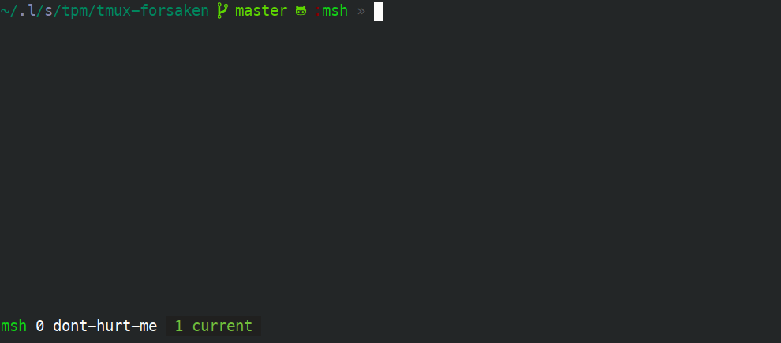

# tmux-forsaken

This tpm plugin provides two scripts:

1. `tmux-kill-empty-panes.sh`
2. `tmux-kill-window-to-the-right.sh`



# Installation

Using [TPM](https://github.com/tmux-plugins/tpm):

```
set -g @plugin 'pschmitt/tmux-forsaken'
```

## Configuration

To have this plugin do anything you need to at least set one of
`forsaken-kill-empty-panes-key` or `forsaken-kill-windows-ttr-key`.

They should contain the key that will be bound to respectively killing all
empty panes and killig all windows on the right of the currently active one.

### Available options

- `@forsaken-kill-empty-panes-key`: Key to bind to kill all windows on the right 
of the current one
- `@forsaken-kill-windows-ttr-key`: Key to bind to kill all empty panes in the
current session
- `@forsaken-kill-empty-panes-confirm`: If set this will require a confirmation
before killig all empty panes. Set to `1` or `true` for the default prompt. Set
to any other value to override the default prompt.
- `@forsaken-forsaken-kill-windows-ttr-confirm`: If set this will require a
confirmation before killig all windows to the right. Set to `1` or `true` 
for the default prompt. Set to any other value to override the default prompt.
